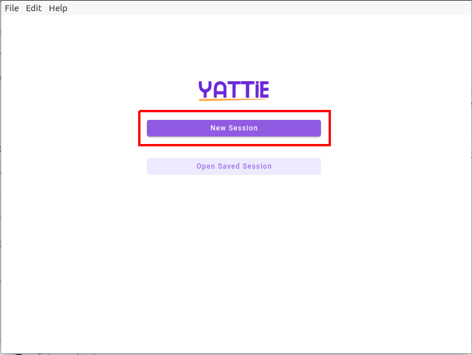

# Quickstart


**Dual purpose:** In addition to more formal testing sessions, YATTIE is great for grabbing some quick evidence to share with your colleagues.  This section walks you through the fastest way to start testing.


The fastest way to get started testing is to do so without any external connections or the structure of a full exploratory session.

Once you open the app you can choose "New Session" to move into the testing workspace.

<figure><figcaption></figcaption></figure>

This will bring you to the "Test Charter" page.  If you have not defined any [checklists.md](../customizations/checklists.md "mention"), then all fields are optional and you can simply click "Start New Session".

<figure><figcaption></figcaption></figure>

You will be prompted to choose which screen or application you'd like to record and gather evidence from.  Make your selection and choose "Start Recording".

Now you should be in the testing workspace.

<figure><figcaption></figcaption></figure>

The buttons along the bottom are for managing the testing session and gathering evidence.

**Session control buttons:**

 Pauses the test session.

.png>) Stops the test session.

**Evidence gathering buttons:**

.png>) Begins and ends recording the selected screen/application.

.png>) Takes a screenshot of the selected screen/application.

.png>) Begins and ends recording audio.

 Add a note (Comment, Problem, Suggestion, Idea, Question, Concern, Positive).

.png>) Create a mind map.

Once you have finished collecting evidence, you can click the "Stop" button which takes you to the test summary screen.

The right-hand column is of particular interest on this screen, as it contains all of the evidence gained in chronological order.

<figure><figcaption></figcaption></figure>

In this column, you can selected evidence to be exported (there are checkboxes on the right hand side).  Once you have selected the evidence you are interested in, you can click the "Export" button and choose where to save the zipped evidence.

<figure><figcaption></figcaption></figure>

You can then find the evidence wherever you saved it - zipped up in a ZIP archive and ready to share!

For a more thorough review of features, you can checkout the [ui-walkthrough](ui-walkthrough/ "mention") page.  For information on directly exporting evidence to your issue tracker or test case management tool of choice, please checkout the [Broken link](broken-reference "mention")pages.

