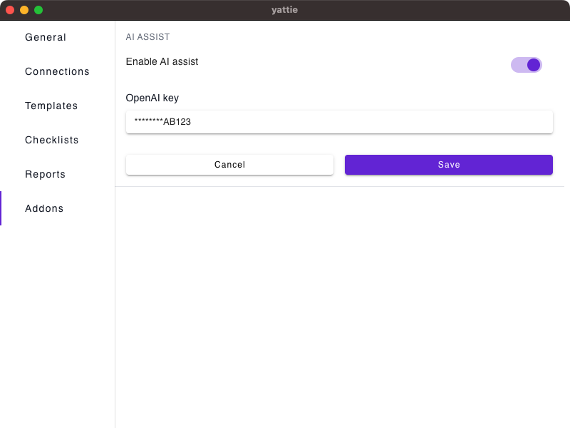

# Addons

The Addons page is home to the settings for various Addons available for YATTIE. Currently, you will find the AI Assist addon configuration here.

<figure><figcaption></figcaption></figure>

1. **AI Assist** **:** Enable AI assistance throughout YATTIE! When toggled, this enhances text fields, providing intelligent suggestions to aid in crafting test charters, notes, and streamlines the overall writing process.
   * **OpenAI Key:** The AI assist feature requires an OpenAI key. You can find your API key in your [User Settings](https://platform.openai.com/account/api-keys) within your OpenAI account.
   * Once configured, locate and toggle the AI Assist icon () within text fields or WYSIWYG editors to activate.
