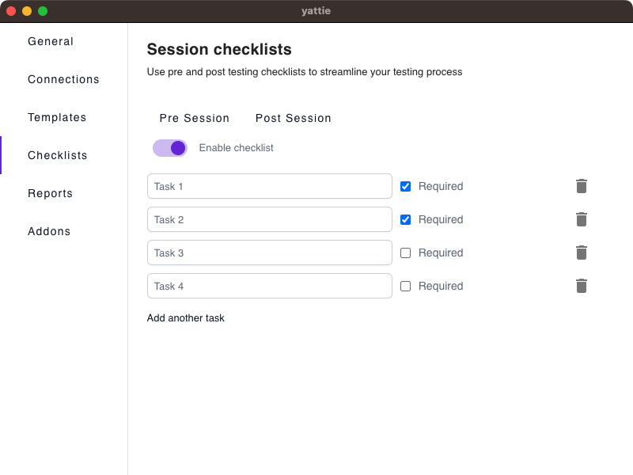

# Checklists

Session Checklists are useful for encouraging (or enforcing) process during testing.

<figure><figcaption></figcaption></figure>

1. **Session Type:** YATTIE supports both **Pre Session** and **Post Session** checklists, enabling you to implement process around your test sessions. Select the tab for the desired session type, and toggle 'Enable checklist' to set up your checklist.
2. **Configuring Checklist:** Once enabled, you can add as many tasks as needed to structure your checklist. Marking a task as 'Required' enforces the task to be followed in order to ensure they aren't missed. You can 'Add another task' or 'Delete' (trashcan icon) them as needed.
