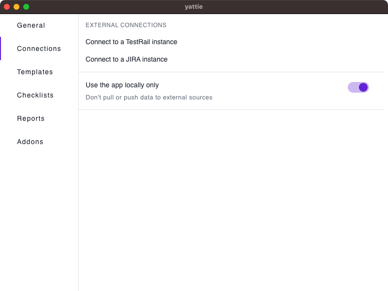

# Connections

YATTIE can make connections to various tools which allows for seamless integration with your testing ecosystem.

<figure><figcaption></figcaption></figure>

1. **External Connections**
   * **Connect to a TestRail instance**: Take you to the Sign in with TestRail page to enter your TestRail credentials and enable the integration.
   * **Connect to a Jira instance:** Takes you to the Sign in with Jira page to Login with Jira Cloud (OAuth) or via Jira Server / Jira Cloud credentials which enables the integration.
2. **Use the app locally only**
   * Toggle the ability to pull or push data to external sources
