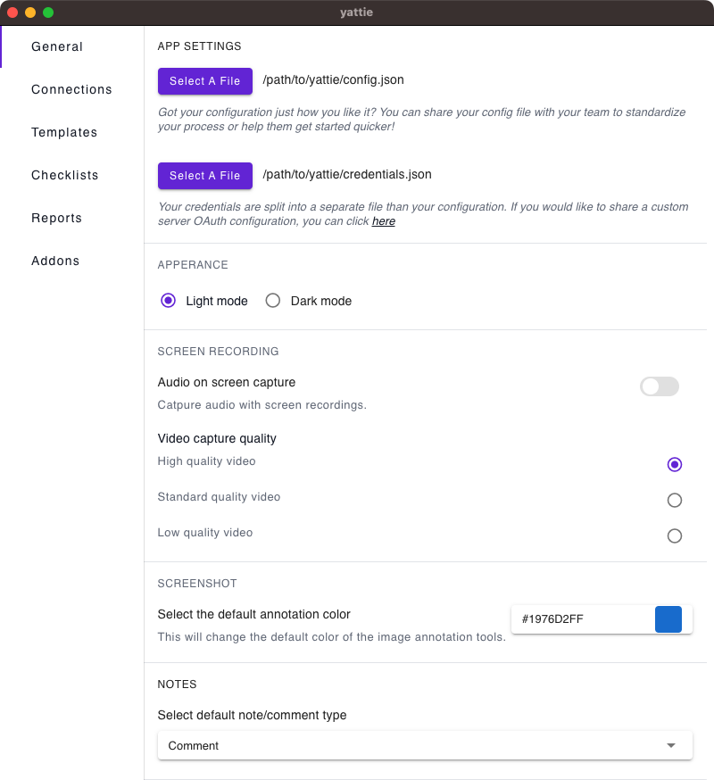
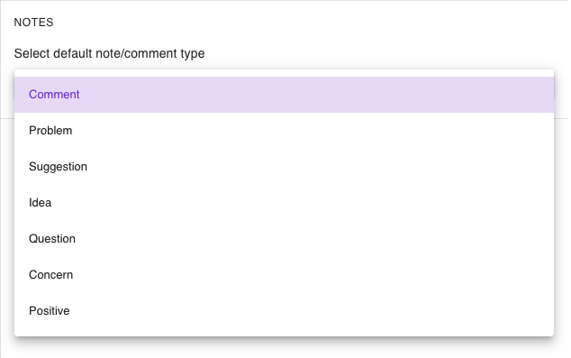

# General

The General settings tab allows you to configure several YATTIE settings and app preferences.

<figure><figcaption></figcaption></figure>

1. **App Settings**
   * **Configuration File:** This file saves your settings in json format, and can be shared with your team to standardize your exploratory testing.
   * **Credentials File:** This file saves various credentials for integrations and addons. You can also share a custom OAuth configuration with your team here.
2. **Appearance**
   * Choose between Light mode or Dark mode.
3. **Screen Recording**
   * **Audio on Screen Capture**: Choose whether to capture audio with screen recordings.
   * **Video Capture Quality**: Choose between High, Standard, or Low quality video recordings.
4. **Screenshot**
   * **Select the default annotation color:** Changes the default color of the image annotation tools.
5. **Notes**
   *   **Select default note/comment type:**\

       

       <figure><figcaption></figcaption></figure>

       

