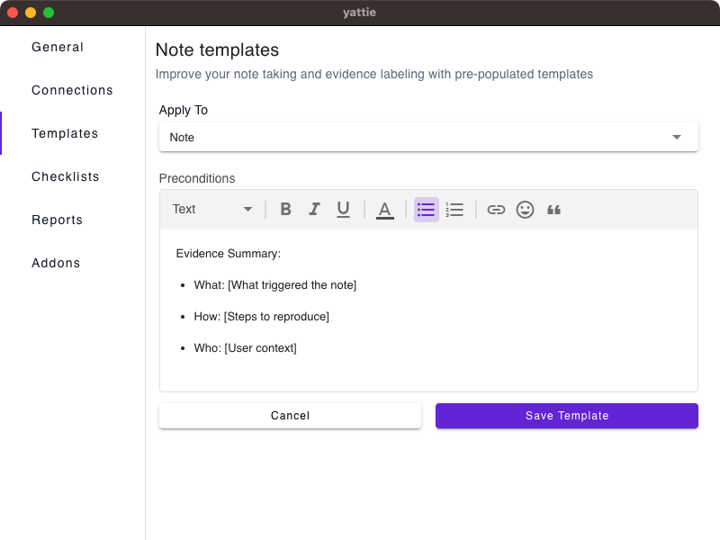
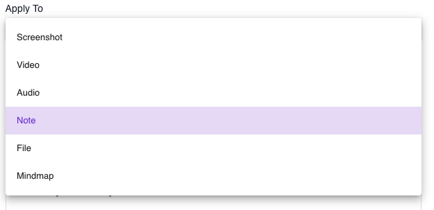

# Templates

Templates streamline your testing by standardizing the format for evidence types that work best for you and your team.

<figure><figcaption></figcaption></figure>

1.  **Apply To**: Choose which evidence type to apply the template to.\

    

    <figure><figcaption></figcaption></figure>

    

2. **Preconditions:** Use the WYSIWYG editor to create your preferred template for the evidence type you selected. You can click **Save Template** to save this.
