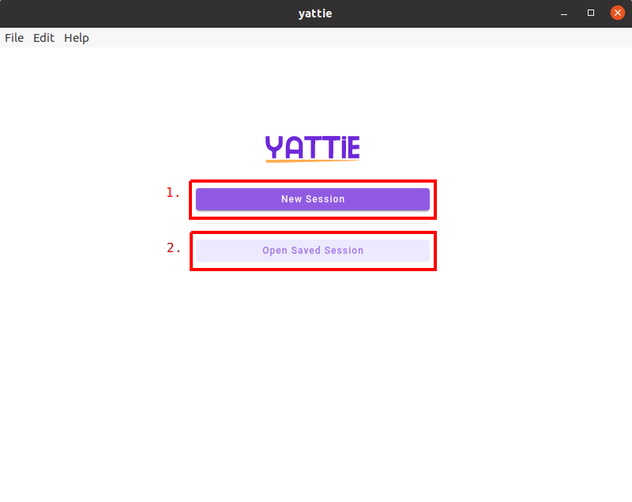

# Start Page

<figure><figcaption></figcaption></figure>

1. **New session button** - Click this button to start a new testing session and gather evidence.  Clicking this button will take you to the Test Charter page.
2. **Open saved session button** - Click this button to open a previous testing session that you have saved on your local computer.

