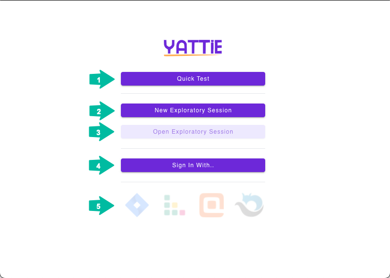

# Start Page

<figure><figcaption></figcaption></figure>

1. **Quick Test** - This button immediately starts a quick test session after selecting the window you'd like to record during the session. This is the fastest way to initiate a test session.
2. **New Exploratory Session** - This button takes you directly to the Test Charter page, where you can configure and start a new testing session to gather evidence.
3. **Open Exploratory Session** - This button opens a previous testing session that you have saved on your local computer.
4. **Sign In With** - This button takes you to the integrations page where you can select which tool you'd like to sign in with. Signing in with a tool enables the integration with YATTIE.
5. **Integration Section** - This row displays the integrations you are currently logged in with, which are shown as fully colored logo icons. Faded icons indicate you are not logged in with that tool.

