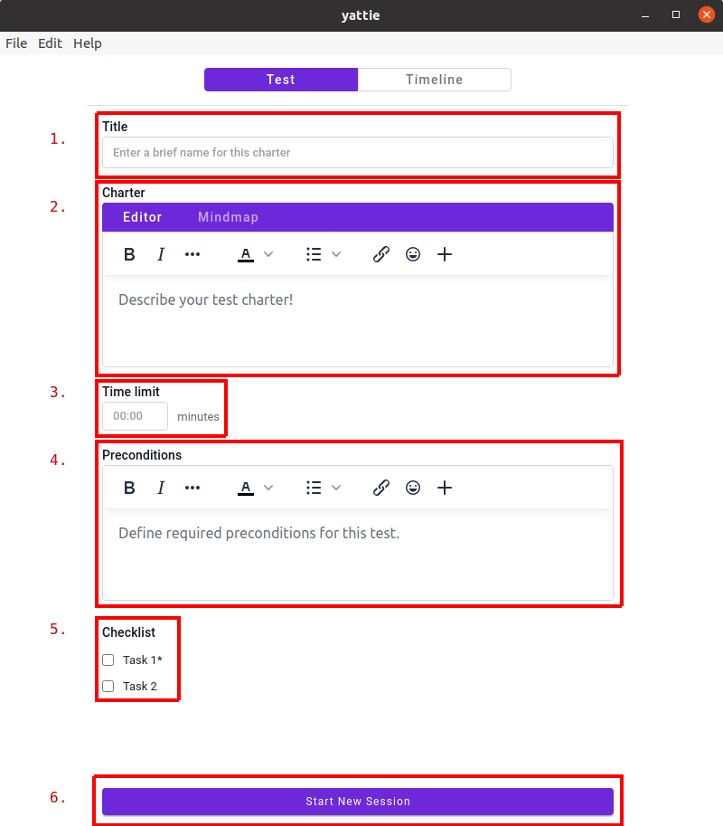

# Test Charter Page

<figure><figcaption></figcaption></figure>

1. **Test session title input** - Input a title for your testing session.  This can be a helpful reference when planning a more formal exploratory session.
2. **Test session charter and mind map** - A session charter helps you lay out what you're trying to accomplish during a testing session.  Likewise, mind maps are a useful tool for brainstorming and planning your sessions in advance.
3. **Test session time limit** - Often, testing sessions will set a time "limit" to devote towards the effort.  While YATTIE doesn't strictly enforce the time limit, it help you manage your time while testing.  (The unit of this field is in _minutes_.)
4. **Test session preconditions** - When you need to provide additional context about what was done before starting your testing session (in case someone needs to reproduce it!), you can include that in this preconditions field.
5. **Pre test session checklist** _**(Optional)**_ - Pre-session checklists are useful for encouraging (or enforcing) process during testing.  Any entry with an asterisk(\*) next to it is mandatory before testing can begin.  These checklists can be configured in the Settings menu: File > App Settings > Checklists
6. **Test session start button** - Once you have filled out whichever relevant inputs (above) you like, click here to start testing!

